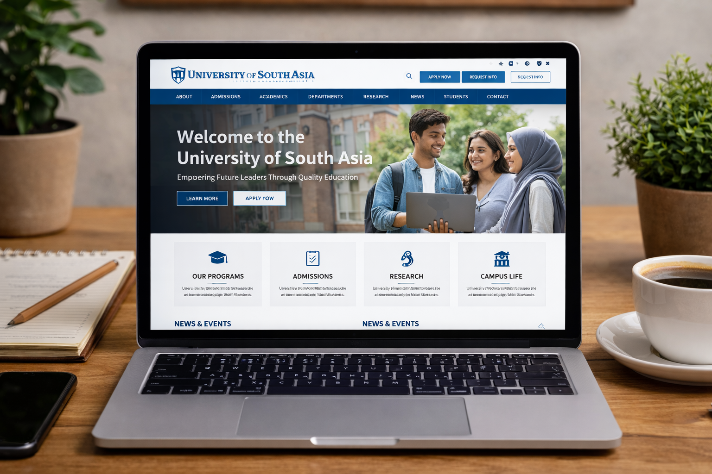
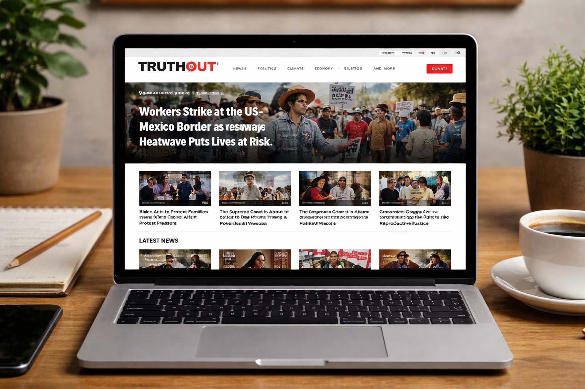
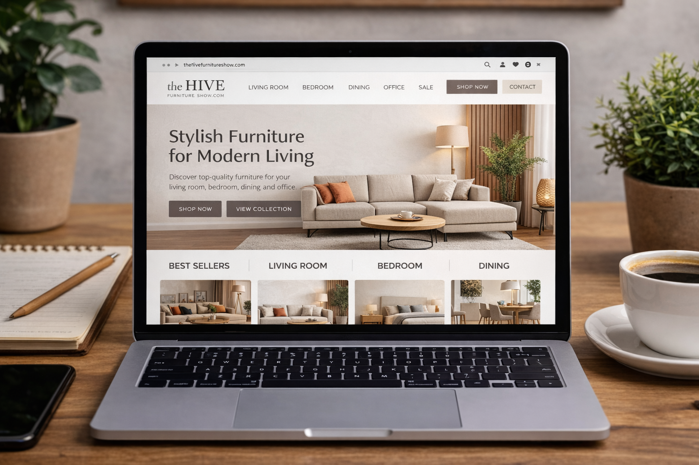
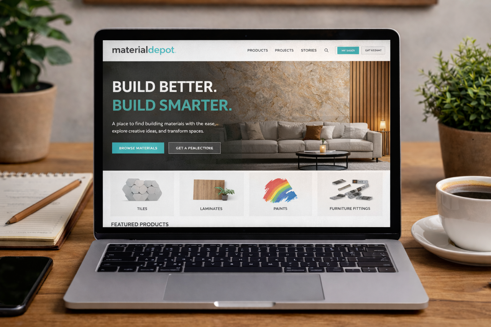

# Adil Ishtiaq

**WordPress & Shopify Developer | Performance-Focused Websites**

🚀 I help businesses and brands build fast, scalable, and conversion-focused websites using WordPress and Shopify.

📄 Resume: [Download CV](Adil%20CV.pdf)  
📧 Email: adilishtiaq8040@gmail.com  
📱 WhatsApp: +92 321 4621709  
🔗 LinkedIn: [adil-ishtiaq](https://www.linkedin.com/in/adil-ishtiaq-651287327)  

---

## 👋 About Me
I am a results-driven WordPress and Shopify developer with 2–3 years of hands-on experience in building high-performance websites. I specialize in clean UI, speed optimization, and user-focused design that helps businesses convert visitors into customers.

I have developed educational platforms, eCommerce stores, and custom WordPress solutions, focusing on reliability, scalability, and ease of use.

---

## 🛠 Core Skills

### Web Development
- WordPress (Themes, Customization, Performance)
- Shopify Store Setup & Customization
- HTML, CSS, JavaScript
- WooCommerce & Payment Integrations

### Design & UI
- Elementor & Gutenberg
- Canva (Professional Graphics)
- Figma (Learning – UI/UX Foundations)

### Performance & Marketing
- Website Speed Optimization
- Basic SEO (On-Page & Technical)
- Conversion-Focused Layouts

---

## 📌 Selected Projects

### 🔹 University of South Asia – Educational Platform

**Link:** [usa.edu.pk](https://usa.edu.pk/)  

**Challenge:** Needed a comprehensive, user-friendly platform for students and faculty.  
**Solution:** Developed a responsive WordPress site with clear navigation, resource sections, and easy content management for staff.  
**Outcome:** Improved student access to academic resources and simplified administrative workflow.  
**Tools:** WordPress, Custom Theme, Elementor  

  <!-- Optional screenshot -->

---

### 🔹 TruthOut – News & Editorial Platform

**Link:** [truthout.org](https://truthout.org/)  

**Challenge:** Required a professional editorial platform for publishing articles with high traffic.  
**Solution:** Customized WordPress themes for optimal readability, responsive design, and performance.  
**Outcome:** Enhanced user engagement and streamlined content publishing for editors.  
**Tools:** WordPress, Elementor, SEO Optimization  

  <!-- Optional screenshot -->

---

### 🔹 Hive Furniture Show – E-Commerce Website

**Link:** [hivefurnitureshow.com](https://hivefurnitureshow.com/)  

**Challenge:** Needed a visually appealing and functional online furniture store.  
**Solution:** Developed WordPress + WooCommerce store with product categories, shopping cart, and mobile-friendly design.  
**Outcome:** Increased online visibility and sales potential for furniture products.  
**Tools:** WordPress, WooCommerce, Elementor, Payment Gateway Integration  

  <!-- Optional screenshot -->

---

### 🔹 Material Depot – E-Commerce Platform

**Link:** [materialdepot.in](https://materialdepot.in/)  

**Challenge:** Create a functional online store for construction materials with easy navigation and checkout.  
**Solution:** Developed a clean, responsive WordPress + WooCommerce site optimized for usability and product browsing.  
**Outcome:** Improved user experience and helped expand online presence.  
**Tools:** WordPress, WooCommerce, Elementor  

  <!-- Optional screenshot -->

---

## 💼 Experience
- 2–3 years of freelance and project-based development
- Experience working with service businesses, startups, and educational platforms
- Strong understanding of client requirements and delivery timelines

---

## 🎯 What I Bring to a Team
- Strong understanding of WordPress & Shopify ecosystems  
- Performance-focused development mindset  
- Clean, maintainable, and scalable solutions  
- Reliable communication and on-time delivery  

---

## 🚀 Available for Work
I’m currently available for freelance projects, internships, and remote roles.

📧 Email: adilishtiaq8040@gmail.com  
📱 WhatsApp: +92 321 4621709  
🔗 LinkedIn: [adil-ishtiaq](https://www.linkedin.com/in/adil-ishtiaq-651287327)
